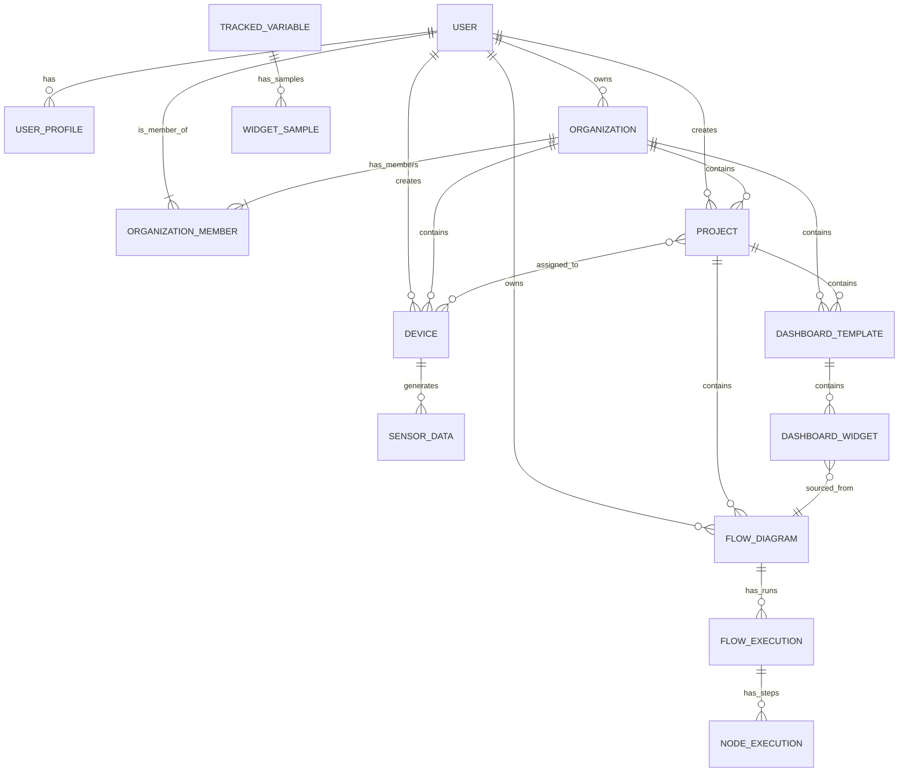

# EdgeSync Platform: Data Model & Entity Relationships

**Author:** CTO  
**Status:** Active
**Last Updated:** July 29, 2025

## 1. Introduction

This document provides a detailed breakdown of the EdgeSync database schema. It describes the core models, their fields, and the critical relationships between them. A clear understanding of this data model is essential for any developer working on the backend.

Our data model is designed around a multi-tenant architecture, with `Organization` as the top-level container for most resources.

## 2. Core Tenancy & User Management (`user` app)

The `user` app manages users, organizations, projects, and their associated permissions.

-   **`User` (Django Built-in):** The standard Django user model. It is the central point for authentication.

-   **`UserProfile`:** A one-to-one extension of the `User` model. It stores application-specific user details like subscription tier (`subscription_type`) and device limits (`device_limit`).

-   **`Organization`:** The primary multi-tenancy model. Every major resource (Projects, Devices, etc.) belongs to an `Organization`.
    -   **Relationship:** An `Organization` has one `owner` (`ForeignKey` to `User`) and many `members`.

-   **`OrganizationMember`:** A through model that links a `User` to an `Organization` and defines their `role` (e.g., 'admin', 'user').
    -   **Relationship:** Many-to-many link between `Organization` and `User`.

-   **`Project`:** A container for `Flows` and `DashboardTemplates` within an `Organization`. This allows for logical grouping of resources for a specific initiative.
    -   **Relationship:** A `Project` belongs to one `Organization` and has one `creator` (`User`).

-   **`DashboardTemplate`:** Defines the layout, widgets, and data sources for a dashboard. These are templates that can be instantiated for different purposes.
    -   **Relationship:** Belongs to one `Organization` and can optionally be linked to a `Project`.

## 3. Device & Sensor Data Management (`sensors` app)

This app is the heart of our IoT data ingestion and management.

-   **`Device`:** Represents a physical or virtual IoT device.
    -   **Key Fields:**
        -   `uuid`: The canonical, unique identifier for the device.
        -   `token`: A unique, secret token used by the device to authenticate with the WebSocket endpoint.
    -   **Relationships:**
        -   Belongs to one `Organization`.
        -   Has one `creator` (`User`).
        -   Can be associated with multiple `Projects` (ManyToMany).

-   **`SensorData`:** The raw, immutable log of every single data point received from a device. This is our system of record.
    -   **Key Fields:**
        -   `device_id`: A string identifier linking the data to a `Device`. Note: This is the `uuid` of the device.
        -   `value`: The numeric value of the sensor reading. For string-based sensor types (like 'location' or 'personal_id'), this is stored as `0.0`, and the original value is preserved in the `raw_data` JSON field.
    -   **Relationship:** Conceptually, each record belongs to a `Device`, linked via the `device_id` field.

-   **`TrackedVariable` & `WidgetSample` (The Live Data Buffer):** These models form a short-term, circular buffer to power live dashboards efficiently.
    -   **`TrackedVariable`:** Acts as a subscription record. It signifies that "Widget X is currently tracking Sensor Y from Device Z."
        -   **Relationship:** It links a `device_id` and `sensor_type` to a specific `widget_id`.
    -   **`WidgetSample`:** Stores the actual data points for a tracked variable.
        -   **Relationship:** `ForeignKey` to `TrackedVariable`. The system ensures that only the latest `max_samples` (e.g., 50) are kept for each `TrackedVariable`, creating an efficient, self-pruning buffer for real-time UI updates.

## 4. Flow & Logic Engine (`flows` app)

This app manages the creation, execution, and monitoring of data processing flows designed in the frontend's Flow Editor.

-   **`FlowDiagram`:** Represents a complete data flow created by a user.
    -   **Key Fields:**
        -   `nodes`: A JSON field storing the state of all nodes from the React Flow editor.
        -   `edges`: A JSON field storing the state of all connections between nodes.
    -   **Relationships:**
        -   Belongs to one `owner` (`User`).
        -   Can be associated with one `Project`.

-   **`FlowExecution` & `NodeExecution`:** These models track the runtime history of a flow.
    -   **`FlowExecution`:** Represents a single run of an entire `FlowDiagram`.
    -   **`NodeExecution`:** Records the execution details (input, output, status) of a single node within a `FlowExecution`.
        -   **Relationship:** A `FlowExecution` has many `NodeExecution` records.

-   **`DashboardWidget`:** This is a critical model that links the world of `Flows` to the world of `Dashboards`.
    -   **Function:** It defines how a specific widget on a dashboard gets its data.
    -   **Data Sources:** A widget can be powered by:
        1.  **`flow_node`:** The output of a specific node in a `FlowDiagram`.
        2.  **`device_sensor`:** Direct data from a device sensor (bypassing the Flow engine).
        3.  **`static`:** Static data defined in the widget itself.
    -   **Relationship:** It links a `dashboard_template_uuid` and `widget_id` to a data source, such as a `FlowDiagram` and a specific `node_id` within it.

## 5. Entity Relationship Summary

This diagram illustrates the primary relationships. Note that some conceptual links (like `Device` to `SensorData` via `device_id`) are not explicit foreign keys but are critical operational links.
